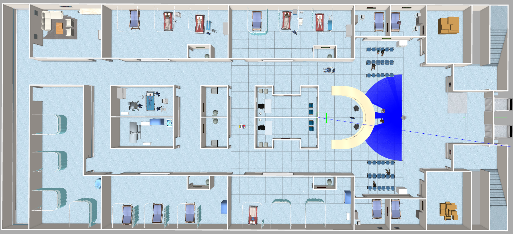

# Implementaciones

Tenía un error cuando crea el contenedor de docker que he enseñado en clase, no he podido resolverlo, que tiene problema utilizando Rocker que no me debaja probar el funcionamiento de la práctica.

Pero la implementación de Merlin2RoomPatrolFsmAction, MissionNode, pddl y Launcher están implementado. 

Faltaba la parte de rotación del robot, que está incompleto por no poder lanzar el proyecto en mi ordenador.


# merlin2-hospital-patrolling

La practica está enfocada al desarrollo de comportamientos simples con una arquitectura cognitiva para ROS 2. Para ello, se va a emplear el simulador de un robot móvil y la arquitectura cognitiva MERLIN2 [[1]](#1) que se basa en YASMIN [[2]](#2) y en KANT [[3]](#3).

## Introducción

Los objetivos planteados para esta práctica son:

- Familiarizarse con los componentes de una arquitecturas cognitiva.
- Comprender el diseño de una arquitectura cognitiva.
- Comprender cómo se han integrado los diferentes componentes de la arquitectura.
- Aprender a desarrollar comportamientos con arquitecturas cognitivas.

## Requisitos

Es necesario disponer de docker y rocker para ejecutar un contenedor con la arquitectura MERLIN2:

- [Docker](https://www.docker.com/)
- [Rocker](https://github.com/osrf/rocker)
- [MERLIN2 Docker Container](https://hub.docker.com/repository/docker/mgons/merlin2/general)
- [merlin2_docker](https://github.com/MERLIN2-ARCH/merlin2_docker)

Dentro del contenedor están disponibles los siguientes elementos:

- [MERLIN2](https://github.com/MERLIN2-ARCH/merlin2)
- [ros2_rb1](https://github.com/mgonzs13/ros2_rb1)
- [ros2_rb1_sandbox](https://github.com/mgonzs13/ros2_rb1_sandbox)

## Práctica

Para llevar a cabo la práctica se va a utilizar el robot RB1 y el mundo del hospital del AWS Robomaker que se presenta en la siguiente figura y en la figura posterior se presenta el mapa del hospital.




Para lanzar el mundo del hospital se utiliza el siguiente comando:

```shell
$ ros2 launch rb1_sandbox hospital.launch.py
```

La práctica consiste en realizar la misión de **patrullar las Stretcher Rooms**, es decir, el robot RB1 tiene que **navegar hasta las cinco Stretched Rooms**. En cada una de ellas tiene que **girar sobre si mismo y avisar de que ha terminado de patrullar esa habitación**. Para realizar las misiones es necesario implementar al menos un nodo de misión en la Mission Layer, las acciones necesarias de la Executive Layer, definir el dominio y el problema PDDL inicial y configurar los sistemas de la Reactive Layer.

## Referencias

<a id="1">[1]</a>
González-Santmarta, M. Á., Rodríguez-Lera, F. J., Fernández-Llamas, C., & Matellán-Olivera, V. (2023). Merlin2: Machined ros 2 planing. Software Impacts, 15, 100477.

<a id="2">[2]</a>
González-Santamarta, M. Á., Rodríguez-Lera, F. J., Matellán-Olivera, V., & Fernández-Llamas, C. (2022, November). YASMIN: Yet another state machine. In Iberian Robotics conference (pp. 528-539). Cham: Springer International Publishing.

<a id="3">[3]</a>
González-Santamarta, M. Á., Rodríguez-Lera, F. J., Martín, F., Fernández, C., & Matellán, V. (2022, May). KANT: A tool for grounding and knowledge management. In International Work-Conference on the Interplay Between Natural and Artificial Computation (pp. 452-461). Cham: Springer International Publishing.
